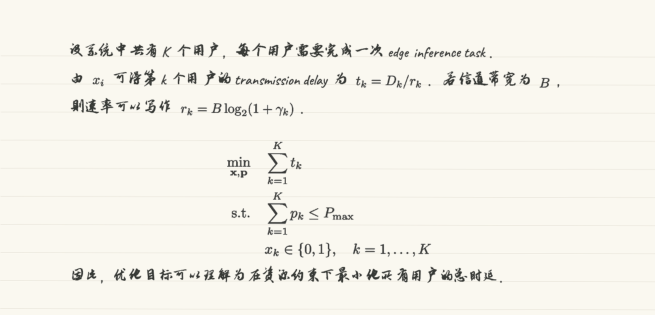

# md2handnote

`md2handnote` 用于把 UTF-8 Markdown 文件转换成不可搜索的手写风格 A4 横线纸 PDF。输入内容可以包含中文、英文和 LaTeX 数学公式。

## 效果预览



## 安装

安装 Python 依赖：

```bash
python -m pip install -e .
```

检查外部依赖 `tectonic`：

```bash
tectonic --version
```

如果本机没有 `tectonic`，请通过系统包管理器或 Tectonic 项目发布页安装。数学公式会通过 LaTeX 渲染，因此需要这个外部程序。

## 字体

工具不会在运行时自动下载字体。请把可用的手写风格字体放到 `fonts/` 目录，并在配置文件里指定路径：

```yaml
fonts:
  chinese_font: ../fonts/ZhiMangXing-Regular.ttf
  english_font: ../fonts/Caveat-wght.ttf
  math_font_hint: null
```

`chinese_font` 和 `english_font` 是必需项。当前示例中文字体使用 `ZhiMangXing-Regular.ttf`，英文使用 `Caveat-wght.ttf`。`math_font_hint` 在当前 MVP 中是可选项，因为公式由 LaTeX 渲染。

## 使用

```bash
md2handnote examples/sample.md -o examples/sample.pdf --config examples/config.yaml --seed 42
```

如果不传 `--seed`，程序会打印本次生成使用的随机种子，方便之后复现同一版输出。

## 当前范围

当前支持的输入：

- 普通文本
- 使用 `$...$` 包裹的行内公式
- 使用 `$$...$$` 包裹的块级公式

标题、列表、表格、图片、代码块和引用块在第一版中不会按特殊 Markdown 结构渲染，会作为普通文本处理，并给出警告。

## 开发

运行测试：

```bash
python -m unittest discover -s tests
```

## 许可证

项目代码使用 MIT 许可证，见 [LICENSE](LICENSE)。

`fonts/` 目录中的字体文件使用各自的 SIL Open Font License 1.1，见 [fonts/LICENSES.md](fonts/LICENSES.md) 和 [fonts/OFL-1.1.txt](fonts/OFL-1.1.txt)。
